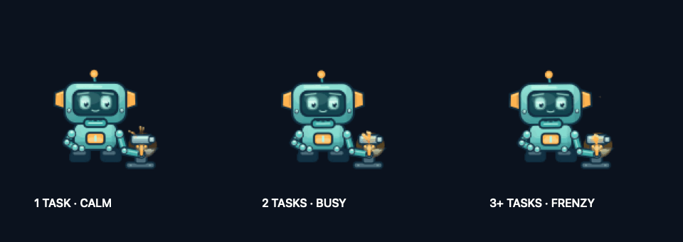

# MechaPets

A tiny robot companion that gives you room to work. MechaPets lives on your Mac’s desktop, swings or jump-dashes away when your cursor approaches, and works at a little forge as your local Codex workload grows.



[Static workshop preview](docs/workload.png) · [Cursor-avoidance preview](docs/preview.png)

## What it does

- Reacts to cursor proximity with animated swings and jump-dashes.
- Hammers calmly for one active Codex task, speeds up for two, and sends sparks flying for three or more.
- Lets clicks pass through its nonactivating desktop panel.
- Provides menu-bar controls for workload reaction, workshop previews, pause, abilities, personal space, and quit.
- Supports reduced motion and constrains escape destinations to display geometry.
- Uses original, programmatically drawn artwork. No downloaded assets or external dependencies.

MechaPets is a standalone macOS companion. It reads local task lifecycle metadata and checks open Codex writer handles; it does not query prompts, titles, messages, or tool output, control your mouse, or send data over the network. The local status adapter uses private Codex database schemas and can require updates when Codex changes. Remote and cloud tasks are not included.

## The workshop

| Active local tasks | Reaction |
| --- | --- |
| 0 | A cool anvil |
| 1 | Calm hammering and small sparks |
| 2 | Faster hammering and more sparks |
| 3+ | A bounded frenzy of hammering and sparks |

Workload reaction is on by default. Use **React to Codex workload** to turn it off, **Choose Codex data folder…** for a nondefault data folder, or **Preview workshop** to try each level for 12 seconds. Preview status is explicitly labeled in the menu.

Cursor avoidance takes priority: the workshop disappears during an escape and reappears when the pet settles. Reduced motion keeps the workshop static. If status cannot be read, the menu shows **Codex status unavailable** and the workshop disappears. A task waiting for approval can still count as active; this is a lifecycle indicator, not a measure of model generation or CPU use.

See [how workload detection works](docs/workload.md) for the adapter, privacy boundaries, and troubleshooting.

## Build and run

Requires macOS 13 or newer and the Xcode Command Line Tools. Install the tools if needed:

```sh
xcode-select --install
```

Clone this repository, enter its directory, then run:

```sh
./build.sh
open "MechaPets.app"
```

The script compiles for your Mac’s native architecture, runs the motion and workload self-tests, and creates a locally ad-hoc-signed app. It is not notarized. No prebuilt binaries are committed, and no Accessibility or network permission is needed.

Use the menu-bar item to adjust the pet or quit it. Tune motion behavior in `Sources/Motion.swift`.

## Verification

The build runs the executable’s `--self-test` mode, including 33 workload and forge assertions. GitHub Actions builds and runs those checks on macOS; CI does not verify the visible desktop interaction. Display geometry checks do not constitute exhaustive testing of every monitor arrangement or full-screen workspace.

Additional local checks:

```sh
./MechaPets.app/Contents/MacOS/MechaPets --workload-status
./MechaPets.app/Contents/MacOS/MechaPets --ui-smoke-test
```

The status command prints only the active count and status, and exits nonzero when unavailable. It uses `CODEX_HOME` when set, otherwise `~/.codex`; the app’s folder-picker preference applies to the running desktop app. The UI smoke test requires a logged-in graphical macOS session.

## Roadmap

- Follow one selected Codex task instead of the aggregate local workload.
- Add richer task semantics, such as testing, attention-needed waves, and completion celebrations, when reliable status signals are available.
- Add more abilities and personality while keeping cursor avoidance the priority.

## Contributing

See [CONTRIBUTING.md](CONTRIBUTING.md). MechaPets is available under the [MIT license](LICENSE). It is an independent project and is not affiliated with OpenAI.
