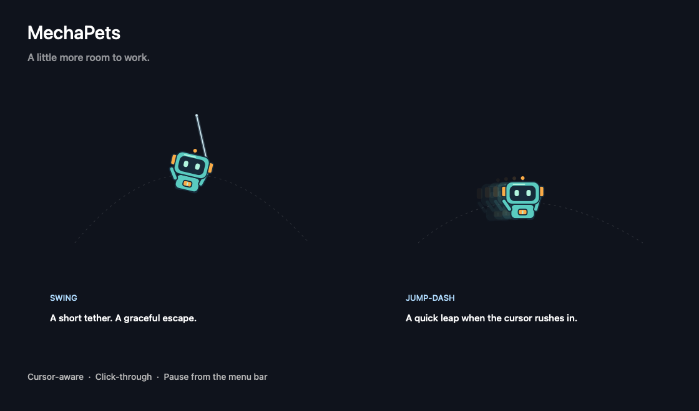

# MechaPets

A tiny robot companion that gives you room to work. MechaPets lives on your Mac’s desktop, swings or jump-dashes away when your cursor approaches, and settles nearby without taking focus.



## What it does

- Reacts to cursor proximity with animated swings and jump-dashes.
- Lets clicks pass through its nonactivating desktop panel.
- Provides menu-bar controls for pause, abilities, personal space, and quit.
- Supports reduced motion and constrains escape destinations to display geometry.
- Uses original, programmatically drawn artwork. No downloaded assets or external dependencies.

MechaPets is a standalone macOS companion, not a modification of Codex. It does not read your tasks, control your mouse, or send data over the network.

## Build and run

Requires macOS 13 or newer and the Xcode Command Line Tools. Install the tools if needed:

```sh
xcode-select --install
```

Clone this repository, enter its directory, then run:

```sh
./build.sh
open "MechaPets.app"
```

The script compiles for your Mac’s native architecture, runs the motion self-tests, and creates a locally ad-hoc-signed app. It is not notarized. No prebuilt binaries are committed, and no Accessibility or network permission is needed.

Use the menu-bar item to adjust the pet or quit it. Tune motion behavior in `Sources/Motion.swift`.

## Verification

The build runs the executable’s `--self-test` mode. GitHub Actions builds and runs those checks on macOS; CI does not verify the visible desktop interaction. Display geometry checks do not constitute exhaustive testing of every monitor arrangement or full-screen workspace.

## Roadmap

- Follow one selected Codex task, using a suitable supported status interface.
- Act out task activity: blacksmith hammering and sparks while working, a wave when attention is needed, and a completion celebration.
- Add more abilities and personality while keeping cursor avoidance the priority.

Task tracking and blacksmith animations are planned, not implemented.

## Contributing

See [CONTRIBUTING.md](CONTRIBUTING.md). MechaPets is available under the [MIT license](LICENSE). It is an independent project and is not affiliated with OpenAI.
